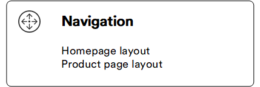
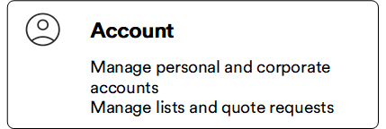
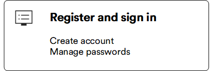

# Overview

This guide is designed to help you navigate and make the most of your shopping experience on our platform. You will find valuable information on how to browse products, manage your account, place orders, and much more. 

Try [Storefront demo site](https://vcst-demo-storefront.paas.govirto.com/).

[Install](https://github.com/VirtoCommerce/vc-theme-b2b-vue) Storefront.

