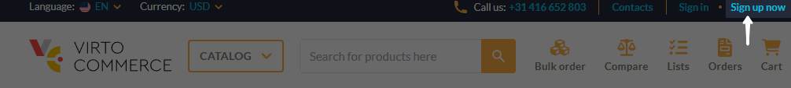
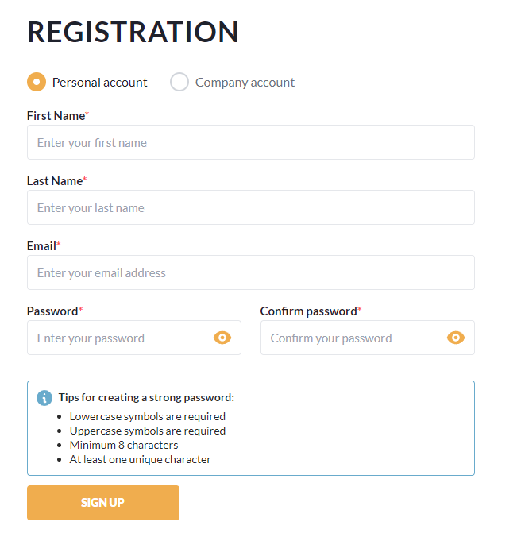

# Create account

To work with the Storefront, you need to create a new account:

1. Open the Storefront and click **Sign up now** in the top right corner.

    

1. Fill in the registration form. All fields are mandatory. Follow the tips for creating a strong password.

    {: width="500"}

    !!! note
        You can create a personal or company account. For a company account, you must provide your company name. More company details will be specified in the account profile after signing in.

1. Click **Sign up**.

1. Check your email inbox for a verification link to complete the registration.

Your account has been registered.

