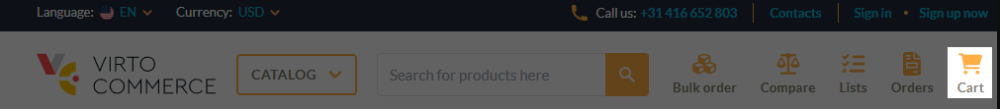
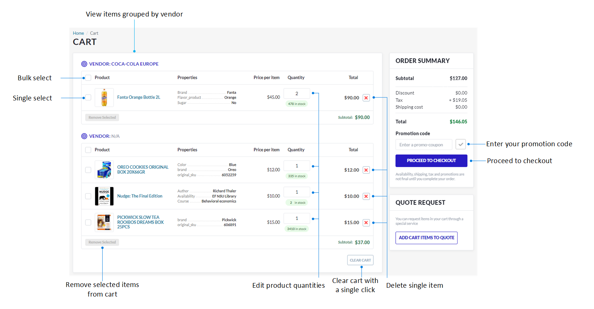
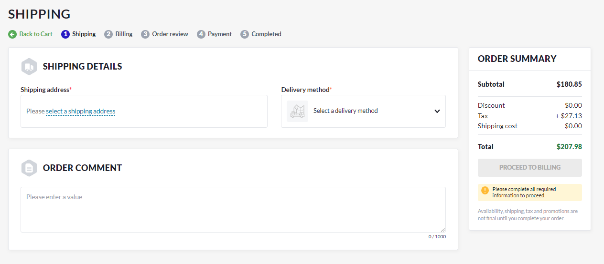
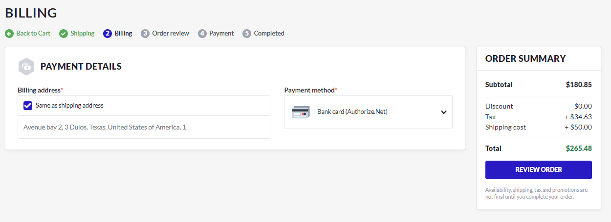
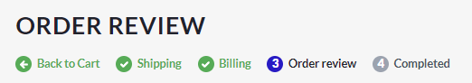
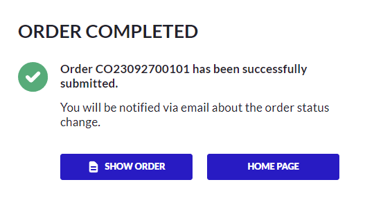

# Checkout

Checkout is the final stage of the online shopping process where customers provide payment and shipping information, review their order, and confirm the purchase. 

To complete your order:

1. Click **Cart** in the top menu to open the cart details:

    

    Here you can:
    
    * View the items you have ordered grouped by user.
    * Change the quantity of items ordered.
    * Delete items in bulk or individually.
    * Clear the cart.
    * Proceed to checkout.

    

1. Click **Proceed to checkout**.

    !!! note
        The checkout process for carts containing only digital products does not include the **Shipping** step since digital products do not require shipping.

1. Specify shipping details:
    * Select a shipping address from the list or add a new one.
    * Select a delivery method from a drop-down list: Ground or Air. The shipping cost appears in the order summary.
    * Enter your comments, if any.

    

1. Click **Proceed to billing** to proceed to the next step.

1. Specify payment details:
    * Select a shipping address from the list, add new one, or check **Same as shipping address**. 
    * Select a payment method from the drop-down list. Selecting payment by bank card adds the **Payment** step to the checkout process. It does not appear if you choose to pay manually. Manual payment allows you to pay for the order later.

    

1. Click **Review order** to review your order details. You can not edit your information here, but you can always return to any of the previous steps by clicking them in the navigation path menu.

    {: width="400"}

    This step allows you to print your order.

1. Click **Place order**. You will see a notification that your order has been successfully placed:

    {: width="400"}

You can view your orders at **Account -> Orders**.

Read more about [Viewing orders.](../account/orders.md)