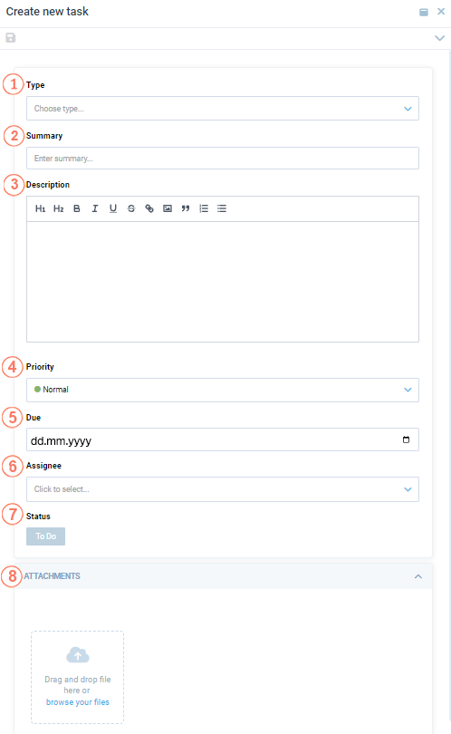
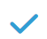

# Using the Tasks application

To start using the Tasks application, сlick  {: width="25" height="25"}  to open the applications menu.

* **My tasks** opens the user's active and completed tasks.
* **All tasks** opens all currently active tasks.
* **Archive** opens all completed tasks.

All tasks can be filtered by:
    
* Type.
* Priority.
* Due date.

## Creating tasks

To create a new task:

1. Select **All tasks** and click {: width="25" height="25"}.

    

    | Item 	| Description                                                                                                                             	|
    |------	|-----------------------------------------------------------------------------------------------------------------------------------------	|
    | 1    	| Select a task type from a dropdown list. Read more about creating and configuring task types in the [Settings](settings.md) section.                             	|
    | 2    	| Descriptive title.                                                                                                                      	|
    | 3    	| Task detailed description (optional).                                                                                                   	|
    | 4    	| Task priority. Select from a dropdown list:  <ul> <li>Lowest.</li> <li>Low.</li> <li>Normal.</li><li>High.</li> <li>Highest.</li></ul>  	|
    | 5    	| Deadline.                                                                                                                               	|
    | 6    	| From a dropdown list, select the employee the task is assigned to. Read more about [Roles and permissions](roles-permissions.md).                        	|
    | 7    	| Current task status. **To do** by default.                                                                                              	|
    | 8    	| Attachments to the task.                                                                                                                	|

1. Click {: width="30" height="30"} to save changes.

The assignee recieves an email notification of the assigned task.

## Processing tasks

To process the assigned task:

1. Open the assigned task using either way:

    1. Click a link in a notification email.
    1. Open the **Tasks** application and go to **My tasks** -> **Active**.

1. Process the task:

    * Click {: width="25" height="25"}. The task wil be archived with the **Done** status. 
    * Click {: width="25" height="25"} to reject the task. The task wil be archived with the **Canceled** status.
    * Click {: width="25" height="25"} to restore the original version of the task.
    * Click {: width="30" height="30"} to save changes.
    * Click {: width="25" height="25"} to delete the task.

