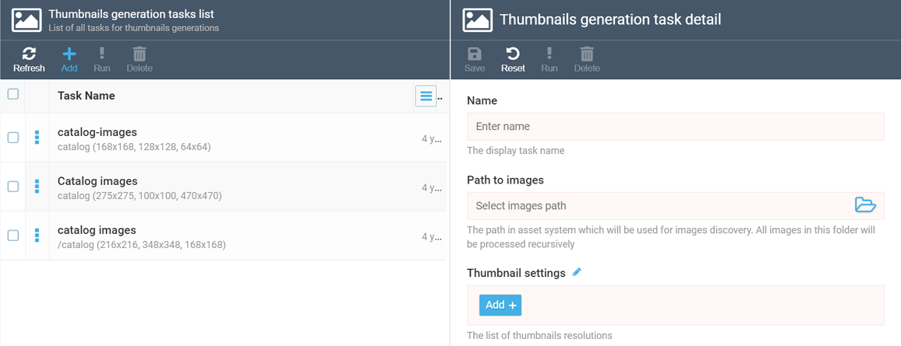
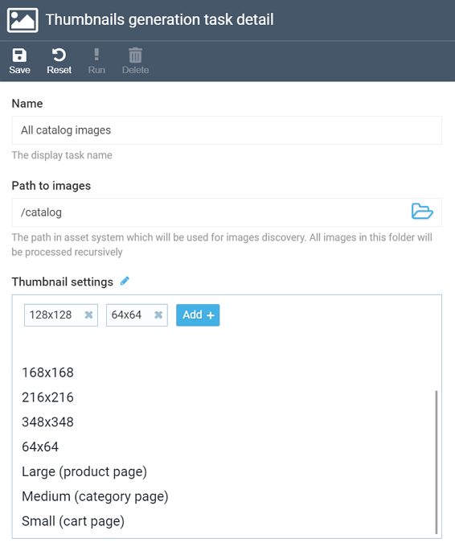
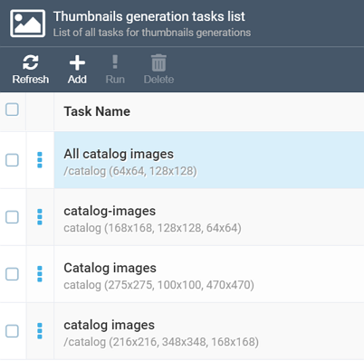
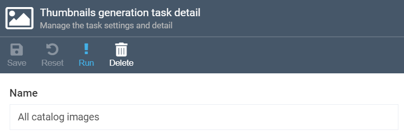
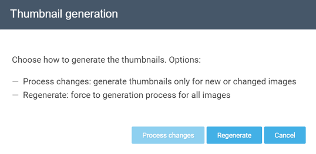


# Generating Thumbnails
As long as your asset folders have any images inside, you can create a new thumbnail generation job and either run it manually or schedule it to run every X hours, days, etc.

## Creating New Job
To create a new thumbnail generation job, navigate to the Thumbnails module and click the ***Add*** button in the top toolbar. This will open the ***Thumbnail generation task details*** screen:

 

Give your job a name (in our example, we call it *All catalog images*, so that one might understand which images it covers) and provide the path to original images.

!!! note
	The ***Path to images*** section allows you to select only an asset folder (and only a single one). You can neither select multiple folders nor individual images.

Finally, select all image sizes that apply:

As you can see, apart from the size in pixels, you can also use the predefined sizes (large, medium, small) we provide out-of-the-box.

!!! note
	You can use any number of resolution options according to your needs. In the example above, for instance, you will get thumbnails for all selected images both with 64x64 and 128x128 size. Please note, however, that selecting many resolution options may lead to slower performance.
	
!!! tip
	For more details on the thumbnail generation options, please refer to [this dedicated guide](thumbnail-options.md). 

Once you are done, hit ***Save*** in the top toolbar. Your job will appear in the list on the Thumbnails module main screen:

## Running Thumbnail Generation Job

### Manual Run
Once you have created your new job, you can immediately run it manually by clicking the respective button on the ***Thumbnails generation task details*** screen's toolbar:

The system will then prompt you to select one of the options: either process all images or run the job for the new images only:

!!! note
	If this your first time to run this job, the ***Process changes*** option will be grayed out.

### Scheduled Run
Apart from running thumbnail generation jobs manually, you can also schedule them to run in the background once in a period of time. To learn how to do this, please proceed to the [Settings](settings.md) section. 
