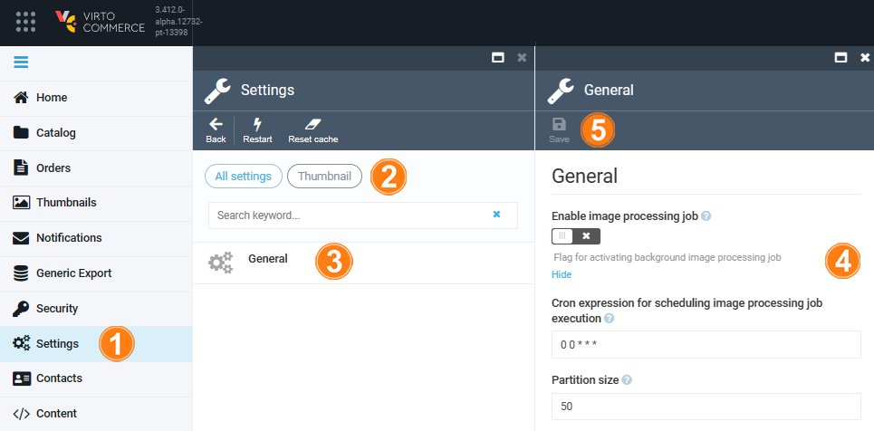


# Thumbnail Settings
To navigate to the Thumbnail module settings, go to ***More -> Settings -> Thumbnails***. The settings consist of the single ***General*** section:

The ***Enable image processing job*** toggle is off by default. Slide it to ON to enable image processing job scheduling.

In the ***Cron expression*** section, you can provide a time period, after which the job will run again.

!!! note
	Currently, providing a cron expression is the only way to schedule your image processing jobs. If you are not familiar with such expressions, you can use free converters, such as [this one](https://www.freeformatter.com/cron-expression-generator-quartz.html).

Finally, the ***Partition size*** section allows you to specify how many images will get processed at a time. By default, it is set to 50. Larger partition sizes may impact the application performance, especially when the images are 'heavy'.
