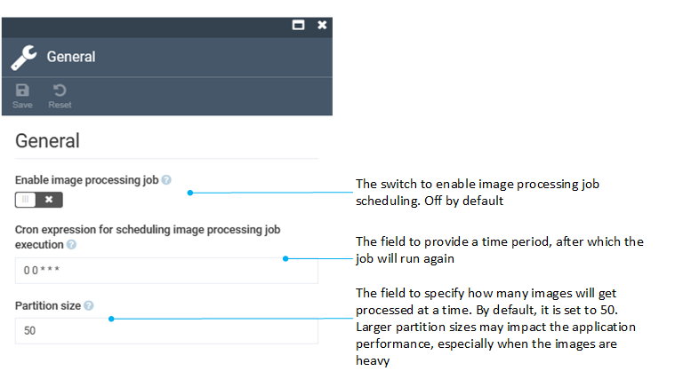

# Settings

To configure Thumbnail settings:

1. Click **Settings** in the main menu.
1. In the search field of the next blade, type **Thumbnail** to find the settings related to customer.
1. Click **General**.
1. In the next blade, configure the following settings: 

    {: width="700"}

1. Click **Save** in the toolbar to save the changes.

The settings have been configured.

[Free cron expression generator](https://www.freeformatter.com/cron-expression-generator-quartz.html){ .md-button }

