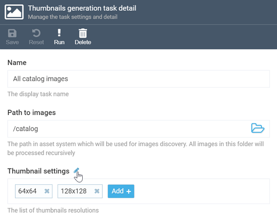
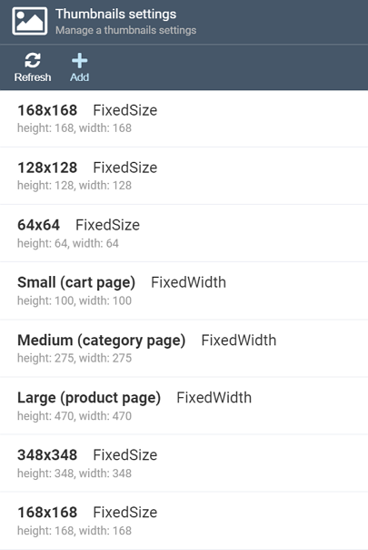
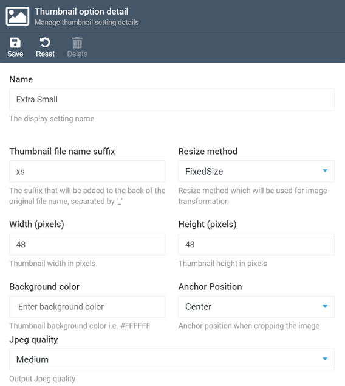

# Managing Thumbnail Settings
Before generating your thumbnails, you can edit various settings in order to adjust what kind of images you get as a result.

To manage thumbnail settings, click the pencil icon near the appropriate option on the ***Thumbnail generation task details*** screen:

This will open the screen with a list of all setting patterns you currently have for thumbnails:

You can both edit the existing patterns and add your own ones.

## Adding Your Own Thumbnail Pattern
Since the settings are always the same both for the existing patters and those you create from scratch, we will, for clarity, show you those settings using the _add new pattern_ scenario.

Let's assume you need to create extra small thumbnails for your product images that you need to show on large and detailed search pages (with 50 items per page or more).

After you click the ***Add*** button on the ***Thumbnail settings*** screen, you will need to provide all required info and options on the ***Thumbnail option details*** screen that will show up:

After giving your new pattern a name, which is self explanatory, you will need to provide the thumbnail file name suffix and the resize method.

### Thumbnail Suffix
Thumbnail file name suffix is a suffix added to the thumbnail image URL as opposed to its 'parent'.
For instance, if the image URL is `../catalog/1428965138000_1133723.jpg`, the thumbnail URL will become `../catalog/1428965138000_1133723_YourSuffix.jpg`.
In our example, we use the `xs` for 'extra small', so the URL will be `../catalog/1428965138000_1133723_xs.jpg`.

!!! tip
	Your suffix should be meaningful so that everyone who works with assets and thumbnails (and especially yourself) could easily identify the purpose of the thumbnail by its file name or URL. Do not make the suffixes too long, however, as they may then make your image URLs even longer.

### Resize Method Options
As for the image resize method, you have the following options available:

+ `FixedSize` method, which resizes the original image to the size you need while maintaining the aspect ratio without cropping. If the aspect ratio of the original image and the thumbnail do not match, the white space will be colored with the background color.

+ `FixedHeight` method that resizes the image while maintaining its height without cropping. The width of thumbnail will be calculated according to the aspect ratio.

+ `FixedWidth` method, similar to the one above, allows you to resize the image while maintaining its width.

+ Finally, the `Crop` method resizes the image until one of the sides matches the provided dimensions, while maintaining the aspect ratio. This means a part of the image will be cut off. The thumbnail will be resized and cropped according to the anchor position (see also below).

### Width and Height
Here, you just need to provide the width and height of your thumbnail, in pixels. In our example, we want an extra small image, so we have 48 for both parameters.

### Backgound Color and Anchor Position
Providing background color is not required but may be handy in some cases. You need to provide it in the hexadecimal format, e.g. _#FFFFFF_ for black, _#FF0000_ for red, etc. (you can use [this tool](https://htmlcolorcodes.com/) to pick the color you need and see its hexadecimal code).

Anchor position is important when it comes to cropping your images. The available options are: top left, top center, top right, center left, center, center right, bottom left, bottom center, and bottom right.

### JPEG Quality
A self explanatory option that allows you to choose between low, medium, high, and very high. In our case, we opted for medium, as there is no need to apply high quality to our tiny thumbnails.
